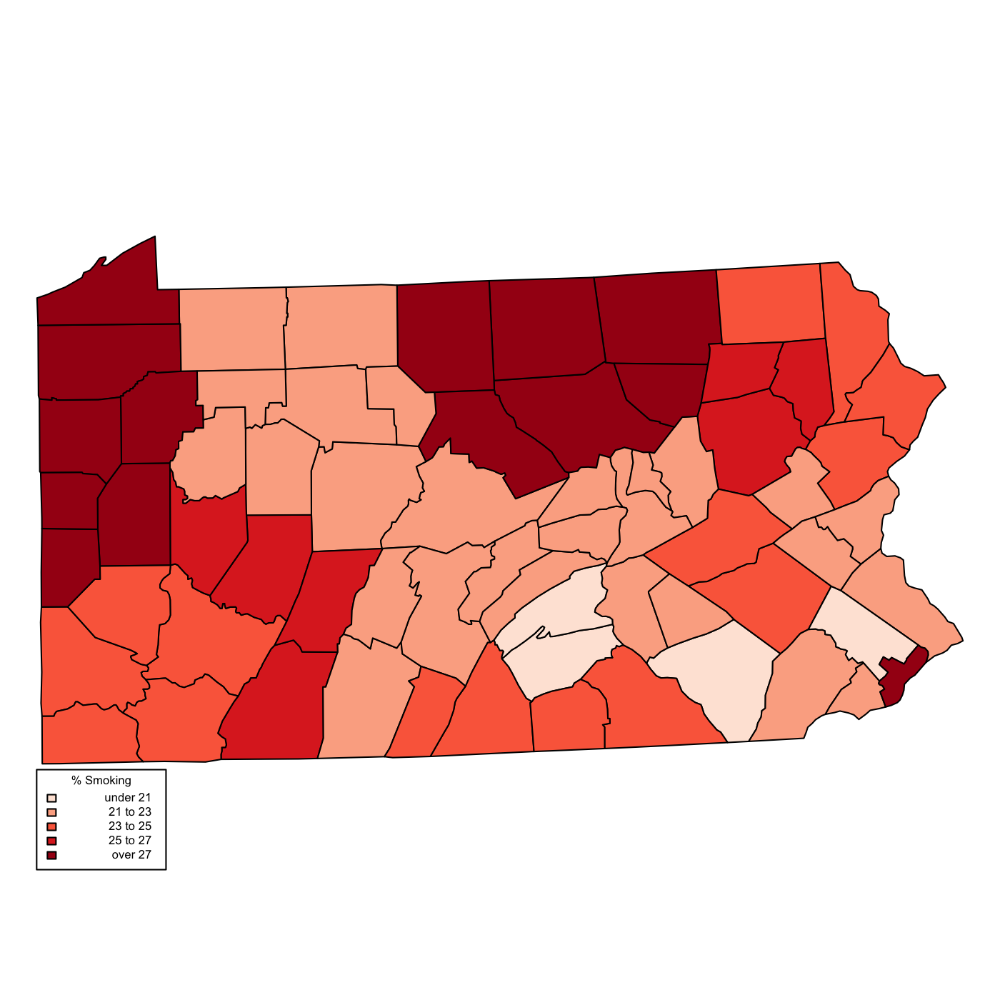
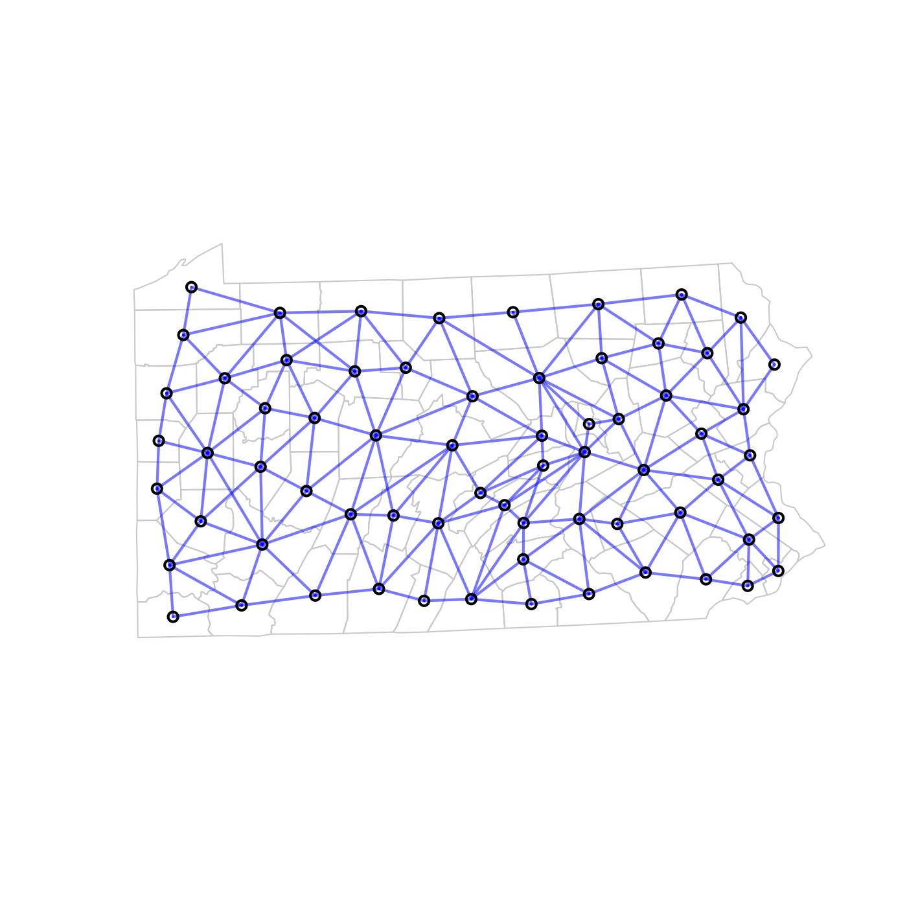
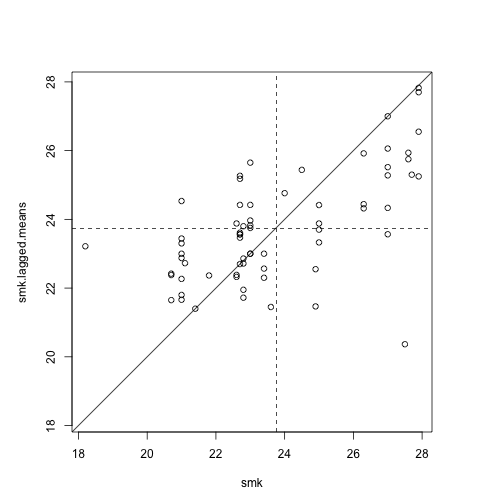

To produce more reproducible research, I am migrating tutorials to Rmarkdown using knitr.
This document was created after following a tutorial from Brunsdon and Comber's 
(2015) An Introduction to R for Spatial Analysis. 

Foremost, I wanted to reproduce their nice vizualization of spatial adjacency networks.

Here are the preliminaries:

```r
require(GISTools)
require(SpatialEpi)
require(rgdal)
require(spdep)
```

The dataset is loaded, coordinates transformed, and a descriptive variable extracted.
From which we can plot spatial distribution of smoking in Pennsylvania:

```r
data(pennLC)
#str(pennLC)
penn.state.latlong <- pennLC$spatial.polygon
penn.state.utm <- spTransform(penn.state.latlong, 
                              CRS("+init=epsg:3724 +units=km +ellps=WGS84"))
smk<-pennLC$smoking$smoking *100
```



But, what I really liked in the tutorial was relationship vizualization:

```r
penn.state.nb <- poly2nb(penn.state.utm)
# The object class "nb" stores a list of neighboring polygons
plot(penn.state.utm, border = "lightgrey")
plot(penn.state.nb, coordinates(penn.state.utm), add = T, col = "#0000FF50", lwd = 2)
```




The authors suggest a first order exploratory approach:
analysis of lagged means, appropriate to continuous data.

That is, the value of polygon divided vs. the unweighted mean of its neighbors. 
A comparison of the polygon value to that of its lagged mean shows anomolies 
that differ from surroundings, as well as points on the 45 degree line that 
share a value similar  to their local neighborhood. 

Moreover, an enrichment of points in 1st and 3rd quadrants 
manifests a degree of spatial auto correlation.


```r
# This object holds the (i) neighbors of each polygon and (ii) their weights

penn.state.lw <- nb2listw(penn.state.nb)
smk.lagged.means <- lag.listw(penn.state.lw, smk)
par(mar =c(5,5,5,5))
plot(smk, smk.lagged.means, asp=1, xlim = range(smk), ylim = range(smk))
abline(0,1)
abline(v=mean(smk), lty=2)
abline(h =mean(smk.lagged.means), lty =2)
```

 

moran.plot(smk,penn.state.lw)
