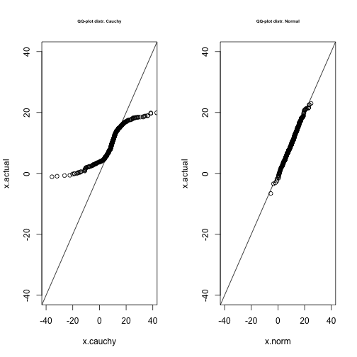
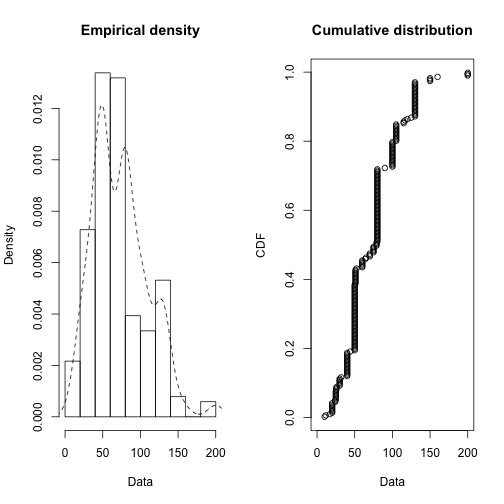
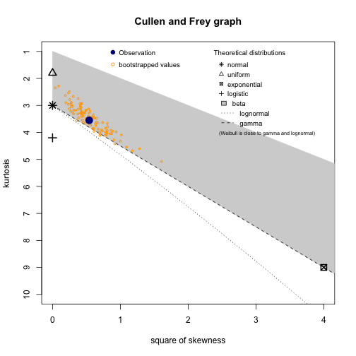
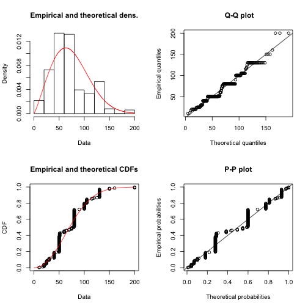
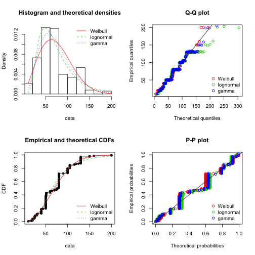

##Fitting Distributions

This meant as repository of examples of R tools I have found useful for fitting distributions.

### Quantile-Quantile Plot

At a miniumum, a Q-Q plot compares the data the fitted and empircal distribution. 
Y-axis values are teh empirical quantiles vs x-values predicted from a theoretical 
distribution. 

Suppose we have some data that are normally distributed, and we test the data against 
a theoretical dataset drawn from a normal with parameters estimated from the samppe.
Departure from the 45 degree line calls into question whether the observed data 
comes form a population with different true parameters.  

Suppose instead we wanted to test if the data might have come from a Cauchy distribution. 
We can fit a Cauchy distribution using the maximum liklihood method implemented
in the **MASS** package via *fitdistr*. Comparision of the qqplots suggests that 
this is a poor choice of distribution. Specifically, the greater departure from the 45 degree line compared with a corresponding qqplot generated under the assumption of a normal distribution.


```r
x.actual <- rnorm(500, 10, 5)
x.norm <-rnorm(500,mean(x.actual),sd(x.actual))
require(MASS)
fit.cauchy <- fitdistr(x.actual, "cauchy")
x.cauchy <- rcauchy(500, fit.cauchy$estimate[1], fit.cauchy$estimate[2])
par(mfrow= c(1,2))
qqplot(x.cauchy,x.actual, xlim = c(-40,40), ylim = c(-40,40) ,main = "QQ-plot distr. Cauchy", cex.main =.5)
abline(0,1)
qqplot(x.norm , x.actual, main = "QQ-plot distr. Normal", cex.main = .5, xlim = c(-40,40), ylim = c(-40,40))
abline(0,1)
```

 

## fitdistrplus

There are a number of nice examples in the vignette of the **fitdistrplus** packages.
see: https://cran.r-project.org/web/packages/fitdistrplus/vignettes/paper2JSS.pdf


```r
require(fitdistrplus)
data("groundbeef")
plotdist(groundbeef$serving, histo = TRUE, demp = TRUE)
```

 

The authors of **fitdistrplus** have added skewness ("assymotry") and kurtosis ("peakedness") to default summary statistics as well as a Cullen and Frey Graph. For their example dataset, we see that the skew and kurtosis of the data could feasibly be modeled with a Weibull, gamma, or lognormal distribution.


```r
par(mfrow = c(1,1))
descdist(groundbeef$serving, boot =100)
```

 

```
## summary statistics
## ------
## min:  10   max:  200 
## median:  79 
## mean:  73.64567 
## estimated sd:  35.88487 
## estimated skewness:  0.7352745 
## estimated kurtosis:  3.551384
```

One of the things that the **fitdistrplus** has going for it is the ease with we can compare many possible 
distributions. The workhorse of parameter estimation is maximum liklihood and is implemented as *fitdist()*
the object it creates comes with methods
* summary() 
* plot()
However the comparison plot methods are cool as they take a list of objects generated by fitdist()


```r
fit.weibull <- fitdist(groundbeef$serving, "weibull" )
fit.gamma   <- fitdist(groundbeef$serving, "gamma"   ) 
fit.lnorm   <- fitdist(groundbeef$serving, "lnorm"   )
plot(fit.weibull)
```

 

```r
par(mfrow = c(2, 2))
plot.legend <- c("Weibull", "lognormal", "gamma")
denscomp( list(fit.weibull, fit.lnorm, fit.gamma), legendtext = plot.legend)
qqcomp(   list(fit.weibull, fit.lnorm, fit.gamma), legendtext = plot.legend)
cdfcomp(  list(fit.weibull, fit.lnorm, fit.gamma), legendtext = plot.legend)
ppcomp(   list(fit.weibull, fit.lnorm, fit.gamma), legendtext = plot.legend)
```

 

```r
par(mfrow = c(1,1))
```

Wow! That is a lot of information in 4 panels. I found the author's decription informative for the evaluation of these distributions:

> "The Q-Q plot emphasizes the lack-of-fit at the distribution tails while the P-P plot emphasizes the lack-of-fit at the distribution center. In the present example (in Figure 3), none of the three fitted distributions correctly describes the center of the distribution, but the Weibull and gamma distributions could be prefered for their better description of the right tail of the empirical distribution, especially if this tail is important in the use of the fitted distribution, as it is in the context of food risk assessment."

That is just the beginning of what the package can do (e.g. alternative methods of parameter estimation, Pareto and Burr distributions). I leave those for the vignette. But one other really cool tool the 
package provides is a way to estimate uncertainty associated with parameter via a bootstrap.


```r
fit.lnorm.boot <- bootdist(fit.lnorm)
par(mfrow = c(1,1))
summary(fit.lnorm.boot)
```

```
## Parametric bootstrap medians and 95% percentile CI 
##            Median      2.5%     97.5%
## meanlog 4.1696483 4.1033505 4.2311263
## sdlog   0.5344043 0.4914052 0.5801146
```

## Vizualizing Distributions


